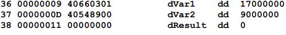

# Assembly Crash Course
## Building Programs
- First opened nano and started coding;
```assembly
.intel_syntax noprefix
mov rdi, 42
mov rax, 60
syscall
```
- Saved it as `quitter.s`
- Next, we compile the file,
```console
┌──(parmon㉿Bob)-[~]
└─$ gcc -nostdlib -o quitter quitter.s
/usr/bin/ld: warning: cannot find entry symbol _start; defaulting to 0000000000001000
┌──(parmon㉿Bob)-[~]
└─$ file quitter
quitter: ELF 64-bit LSB pie executable, x86-64, version 1 (SYSV), dynamically linked, interpreter /lib64/ld-linux-x86-64.so.2, BuildID[sha1]=d4eadffdbf09bd963b370b804fcdd9c2cd404d4c, not stripped
```
- `file` is primarily used to determine the file type
- We can check the execution using this;
```console
┌──(parmon㉿Bob)-[~]
└─$ ./quitter

┌──(parmon㉿Bob)-[~]
└─$ echo $?
42
```
- `echo $?` shows the exit status of the last executed code.
- The `mov rdi, 42` line in the program determines the exit status.
- You can also disassemble a program by;
```console
┌──(parmon㉿Bob)-[~]
└─$ objdump -M intel -d quitter

quitter:     file format elf64-x86-64


Disassembly of section .text:

0000000000001000 <.text>:
    1000:       48 c7 c7 2a 00 00 00    mov    rdi,0x2a
    1007:       48 c7 c0 3c 00 00 00    mov    rax,0x3c
    100e:       0f 05                   syscall
```
##### Extracting Binary Code
```console
┌──(parmon㉿Bob)-[~]
└─$ objcopy --dump-section .text=quitter_binary_code quitter
```
- This command extracts the .text section (the part containing executable instructions) from the compiled binary (quitter) into a separate file named `quitter_binary_code`.
```console
┌──(parmon㉿Bob)-[~]
└─$ hd quitter_binary_code
00000000  48 c7 c7 2a 00 00 00 48  c7 c0 3c 00 00 00 0f 05  |H..*...H..<.....|
00000010
```
- `hd` (hexdump) the raw binary content of the file in hexadecimal format.

## Assembly Guide Book
### Tool Chain
- _yasm_ assembler command for reading the assembly language source
file is as follows:
```
yasm -g dwarf2 -f elf64 example.asm -l example.lst
```
- The `-g dwarf2` option is used to inform the assembler to include debugging information in the final object file. This increases the size of the object file, but is
necessary to allow effective debugging.
- The `-f elf64` informs the assembler to create the object file in the ELF6427 format which is appropriate for 64-bit, Linux-based systems.
- The example.asm is the name of the assembly language source file for input. The `-l example.lst` informs the assembler to create a list file named example.lst.
-  **List file** shows the line number, the relative address, the machine language version of the instruction
(including variable references), and the original source line.

- `36` -> Line number
- `0x00000009` -> relative address in the data area.
- Since dVar1 is a double-word (requires 4 bytes), the next variabe will be at 0x0000000D
- `0x40660301` -> value in hex.
### Two-Pass assembler
- Suppose there is an _if-condition_ with a forward jmp(called forward reference), so while the assembler is reading line by line it does not know of the upcoming jump location, hence we use two pass where the code is read twice.
#### First Pass
- Steps
    - Create symbol table
    - Expand macros 
    - Evaluate constant expressions
#### Second Pass
- Steps
    - Final generation of code
    - Creation of list file (if requested)
    - Create object file

- **Assembler directives** are instructions to the assembler that direct the assembler to do
something.

# --Challenges--
### set-register
- Run the challenge
```console
hacker@assembly-crash-course~set-register:/$ /challenge/run

In this level you will be working with registers. You will be asked to modify
or read from registers.


In this level you will work with registers! Please set the following:
  rdi = 0x1337

You ran me without an argument. You can re-run with `/challenge/run /path/to/your/elf` to input an ELF file, or just give me your assembled and extracted code in bytes (up to 0x1000 bytes):
```
- used nano to create a _.asm_ file.
```
BITS 64

section .text
        global _start

_start:
        mov rdi, 0x1337 ; setting value
        mov rax, 60     ; System call number for exit (64-bit)
        syscall         ; Make the system call
```
- Then we assemble
```console
nasm -f elf64 -o setreg.o setreg.asm
```
- Link the file to create the ELF
```console
ld -s -o setreg setreg.o
```
- Then I ran the challenge with the argument as the path to the elf file.
```
hacker@assembly-crash-course~set-register:~$ /challenge/run /home/hacker/setreg

In this level you will be working with registers. You will be asked to modify
or read from registers.


In this level you will work with registers! Please set the following:
  rdi = 0x1337

Extracting binary code from provided ELF file...
Executing your code...
---------------- CODE ----------------
0x400000:       mov     edi, 0x1337
0x400005:       mov     eax, 0x3c
0x40000a:       syscall
--------------------------------------
pwn.college{wy-Zqap-_QFyq9qwxDuqkiVWzCN.0FN5EDLyITMzYzW}
```

### set-multiple-registers
-

```
BITS 64

section .text
        global _start

_start:
        mov rax, 0x1337    
        mov r12, 0xCAFED00D1337BEEF ; setting value
        mov rsp, 0x31337
        xor rdi, rdi    ; set exit code 0
        hlt         ; makes the program crash
```
- Here I had to make the program crash as the other way to exit will require me to overwrite the value of the `rax` register.
- Then same process as last program.

### add-to-register
- 
```
BITS 64

section .text
        global _start

_start:
        add rdi, 0x331337    
        mov rax, 60     ; syscall for exit
        syscall
```
- 
```
hacker@assembly-crash-course~add-to-register:~$ nano addreg.asm
hacker@assembly-crash-course~add-to-register:~$ nasm -f elf64 -o addreg.o addreg.asm
hacker@assembly-crash-course~add-to-register:~$ ld -s -o addreg addreg.o
hacker@assembly-crash-course~add-to-register:~$ /challenge/run /home/hacker/addreg

In this level you will be working with registers. You will be asked to modify
or read from registers.

We will now set some values in memory dynamically before each run. On each run
the values will change. This means you will need to do some type of formulaic
operation with registers. We will tell you which registers are set beforehand
and where you should put the result. In most cases, its rax.


Many instructions exist in x86 that allow you to do all the normal
math operations on registers and memory.

For shorthand, when we say A += B, it really means A = A + B.

Here are some useful instructions:
  add reg1, reg2       <=>     reg1 += reg2
  sub reg1, reg2       <=>     reg1 -= reg2
  imul reg1, reg2      <=>     reg1 *= reg2

div is more complicated and we will discuss it later.
Note: all 'regX' can be replaced by a constant or memory location

Do the following:
  add 0x331337 to rdi

We will now set the following in preparation for your code:
  rdi = 0xdc5

Extracting binary code from provided ELF file...
Executing your code...
---------------- CODE ----------------
0x400000:       add     rdi, 0x331337
0x400007:       mov     eax, 0x3c
0x40000c:       syscall
--------------------------------------
pwn.college{kOxz-Qf2dU99kflfwtsnTxNmdc8.0VN5EDLyITMzYzW}
```

### linear-equation-registers
- 
```
hacker@assembly-crash-course~linear-equation-registers:~$ nano lineqnreg.asm

BITS 64

section .text
        global _start

_start:
        mov rax, rdi
        imul rax, rsi
        add rax, rdx
        hlt
```
```
hacker@assembly-crash-course~linear-equation-registers:~$ nasm -f elf64 -o lineqnreg.o lineqnreg.asm
hacker@assembly-crash-course~linear-equation-registers:~$ ld -s -o lineqnreg lineqnreg.o
hacker@assembly-crash-course~linear-equation-registers:~$ /challenge/run /home/hacker/lineqnreg

In this level you will be working with registers. You will be asked to modify
or read from registers.

We will now set some values in memory dynamically before each run. On each run
the values will change. This means you will need to do some type of formulaic
operation with registers. We will tell you which registers are set beforehand
and where you should put the result. In most cases, its rax.


Using your new knowledge, please compute the following:
  f(x) = mx + b, where:
    m = rdi
    x = rsi
    b = rdx

Place the result into rax.

Note: there is an important difference between mul (unsigned
multiply) and imul (signed multiply) in terms of which
registers are used. Look at the documentation on these
instructions to see the difference.

In this case, you will want to use imul.

We will now set the following in preparation for your code:
  rdi = 0x17c0
  rsi = 0xf0f
  rdx = 0x1d99

Extracting binary code from provided ELF file...
Executing your code...
---------------- CODE ----------------
0x400000:       mov     rax, rdi
0x400003:       imul    rax, rsi
0x400007:       add     rax, rdx
0x40000a:       hlt
--------------------------------------
pwn.college{U6nMWyu_Q65Ew8R-OzOg8CRS62F.0lN5EDLyITMzYzW}
```

### integer-division
- 
```
~$ nano intdiv.asm

BITS 64

section .text
        global _start

_start:
        mov rdx, 0
        mov rax, rdi
        div rsi
        hlt
```
```

~$ nasm -f elf64 -o intdiv.o intdiv.asm
~$ ld -s -o intdiv intdiv.o
~$ /challenge/run /home/hacker/intdiv

In this level you will be working with registers. You will be asked to modify
or read from registers.

We will now set some values in memory dynamically before each run. On each run
the values will change. This means you will need to do some type of formulaic
operation with registers. We will tell you which registers are set beforehand
and where you should put the result. In most cases, its rax.


Division in x86 is more special than in normal math. Math in here is
called integer math. This means every value is a whole number.

As an example: 10 / 3 = 3 in integer math.

Why?

Because 3.33 is rounded down to an integer.

The relevant instructions for this level are:
  mov rax, reg1; div reg2

Note: div is a special instruction that can divide
a 128-bit dividend by a 64-bit divisor, while
storing both the quotient and the remainder, using only one register as an operand.

How does this complex div instruction work and operate on a
128-bit dividend (which is twice as large as a register)?

For the instruction: div reg, the following happens:
  rax = rdx:rax / reg
  rdx = remainder

rdx:rax means that rdx will be the upper 64-bits of
the 128-bit dividend and rax will be the lower 64-bits of the
128-bit dividend.

You must be careful about what is in rdx and rax before you call div.

Please compute the following:
  speed = distance / time, where:
    distance = rdi
    time = rsi
    speed = rax

Note that distance will be at most a 64-bit value, so rdx should be 0 when dividing.

We will now set the following in preparation for your code:
  rdi = 0x17b9
  rsi = 0x1c

Extracting binary code from provided ELF file...
Executing your code...
---------------- CODE ----------------
0x400000:       mov     edx, 0
0x400005:       mov     rax, rdi
0x400008:       div     rsi
0x40000b:       hlt
--------------------------------------
pwn.college{cQu0pmYKGF63ACLYQrLw2GrumTx.01N5EDLyITMzYzW}
```

### modulo-operation
-
```
~$ nano modop.asm

BITS 64

section .text
        global _start

_start:
        mov rdx, 0
        mov rax, rdi
        div rsi
        mov rax, rdx
        hlt
```
```
~$ nasm -f elf64 -o modop.o modop.asm
~$ ld -s -o modop modop.o
~$ /challenge/run /home/hacker/modop

In this level you will be working with registers. You will be asked to modify
or read from registers.

We will now set some values in memory dynamically before each run. On each run
the values will change. This means you will need to do some type of formulaic
operation with registers. We will tell you which registers are set beforehand
and where you should put the result. In most cases, its rax.


Modulo in assembly is another interesting concept!

x86 allows you to get the remainder after a div operation.

For instance: 10 / 3 -> remainder = 1

The remainder is the same as modulo, which is also called the "mod" operator.

In most programming languages we refer to mod with the symbol '%'.

Please compute the following:
  rdi % rsi

Place the value in rax.

We will now set the following in preparation for your code:
  rdi = 0x34a416a1
  rsi = 0xffff

Extracting binary code from provided ELF file...
Executing your code...
---------------- CODE ----------------
0x400000:       mov     edx, 0
0x400005:       mov     rax, rdi
0x400008:       div     rsi
0x40000b:       mov     rax, rdx
0x40000e:       hlt
--------------------------------------
pwn.college{wWXhxjP9wrFe2B8hkN7EjQ1lxok.0FO5EDLyITMzYzW}
```

### set-upper-bytes
- I first wrote hlt after the mov line to end program, it wasn't accepted so I just removed hlt and it worked.
```
~$ nano setuppbyt.asm

BITS 64

section .text
        global _start

_start:
        mov ah, 0x42
```

```

~$ nasm -f elf64 -o setuppbyt.o setuppbyt.asm
~$ ld -s -o setuppbyt setuppbyt.o
~$ /challenge/run /home/hacker/setuppbyt

In this level you will be working with registers. You will be asked to modify
or read from registers.

We will now set some values in memory dynamically before each run. On each run
the values will change. This means you will need to do some type of formulaic
operation with registers. We will tell you which registers are set beforehand
and where you should put the result. In most cases, its rax.


Another cool concept in x86 is the ability to independently access to lower register bytes.

Each register in x86_64 is 64 bits in size, and in the previous levels we have accessed
the full register using rax, rdi or rsi.

We can also access the lower bytes of each register using different register names.

For example the lower 32 bits of rax can be accessed using eax, the lower 16 bits using ax,
the lower 8 bits using al.

MSB                                    LSB
+----------------------------------------+
|                   rax                  |
+--------------------+-------------------+
                     |        eax        |
                     +---------+---------+
                               |   ax    |
                               +----+----+
                               | ah | al |
                               +----+----+

Lower register bytes access is applicable to almost all registers.

Using only one move instruction, please set the upper 8 bits of the ax register to 0x42.

We will now set the following in preparation for your code:
  rax = 0xcbafc2f66679003b

Extracting binary code from provided ELF file...
Executing your code...
---------------- CODE ----------------
0x400000:       mov     ah, 0x42
--------------------------------------
pwn.college{4hryxg7JP5nix3DoZAFAdi8HJ0q.dFTM4MDLyITMzYzW}
```

### efficient-modulo
- If we have x % y, and y is a power of 2, such as 2^n, the result will be the lower n bits of x.
```
~$nano effmod.asm

BITS 64

section .text
        global _start

_start:
        mov rax, 0
        mov al, dil
        mov rbx, 0
        mov bx, si
```
- Here since it is mod 256, and log(base 2) 256 = 8, we just have to move the lower 8 bits which is dil.
- For 65536 we use lower 16 bits, which is si
- We have to use registers of same size in the mov functions.
- We also have to clear the upper bits of the registers by setting them to 0.

```
~$ nasm -f elf64 -o effmod.o effmod.asm
~$ ld -s -o effmod effmod.o
~$ /challenge/run /home/hacker/effmod

In this level you will be working with registers. You will be asked to modify
or read from registers.

We will now set some values in memory dynamically before each run. On each run
the values will change. This means you will need to do some type of formulaic
operation with registers. We will tell you which registers are set beforehand
and where you should put the result. In most cases, its rax.


It turns out that using the div operator to compute the modulo operation is slow!

We can use a math trick to optimize the modulo operator (%). Compilers use this trick a lot.

If we have "x % y", and y is a power of 2, such as 2^n, the result will be the lower n bits of x.

Therefore, we can use the lower register byte access to efficiently implement modulo!

Using only the following instruction(s):
  mov

Please compute the following:
  rax = rdi % 256
  rbx = rsi % 65536

We will now set the following in preparation for your code:
  rdi = 0x71b7
  rsi = 0xb161c77

Extracting binary code from provided ELF file...
Executing your code...
---------------- CODE ----------------
0x400000:       mov     eax, 0
0x400005:       mov     al, dil
0x400008:       mov     ebx, 0
0x40000d:       mov     bx, si
--------------------------------------
pwn.college{09fANiqihxiBamdA1xDnc1hZVPv.0VO5EDLyITMzYzW}
```
