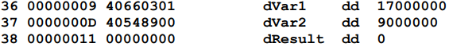

# Assembly Crash Course
## Building Programs
- First opened nano and started coding;
```assembly
.intel_syntax noprefix
mov rdi, 42
mov rax, 60
syscall
```
- Saved it as `quitter.s`
- Next, we compile the file,
```console
┌──(parmon㉿Bob)-[~]
└─$ gcc -nostdlib -o quitter quitter.s
/usr/bin/ld: warning: cannot find entry symbol _start; defaulting to 0000000000001000
┌──(parmon㉿Bob)-[~]
└─$ file quitter
quitter: ELF 64-bit LSB pie executable, x86-64, version 1 (SYSV), dynamically linked, interpreter /lib64/ld-linux-x86-64.so.2, BuildID[sha1]=d4eadffdbf09bd963b370b804fcdd9c2cd404d4c, not stripped
```
- `file` is primarily used to determine the file type
- We can check the execution using this;
```console
┌──(parmon㉿Bob)-[~]
└─$ ./quitter

┌──(parmon㉿Bob)-[~]
└─$ echo $?
42
```
- `echo $?` shows the exit status of the last executed code.
- The `mov rdi, 42` line in the program determines the exit status.
- You can also disassemble a program by;
```console
┌──(parmon㉿Bob)-[~]
└─$ objdump -M intel -d quitter

quitter:     file format elf64-x86-64


Disassembly of section .text:

0000000000001000 <.text>:
    1000:       48 c7 c7 2a 00 00 00    mov    rdi,0x2a
    1007:       48 c7 c0 3c 00 00 00    mov    rax,0x3c
    100e:       0f 05                   syscall
```
##### Extracting Binary Code
```console
┌──(parmon㉿Bob)-[~]
└─$ objcopy --dump-section .text=quitter_binary_code quitter
```
- This command extracts the .text section (the part containing executable instructions) from the compiled binary (quitter) into a separate file named `quitter_binary_code`.
```console
┌──(parmon㉿Bob)-[~]
└─$ hd quitter_binary_code
00000000  48 c7 c7 2a 00 00 00 48  c7 c0 3c 00 00 00 0f 05  |H..*...H..<.....|
00000010
```
- `hd` (hexdump) the raw binary content of the file in hexadecimal format.

## Assembly Guide Book
### Tool Chain
- _yasm_ assembler command for reading the assembly language source
file is as follows:
```
yasm -g dwarf2 -f elf64 example.asm -l example.lst
```
- The `-g dwarf2` option is used to inform the assembler to include debugging information in the final object file. This increases the size of the object file, but is
necessary to allow effective debugging.
- The `-f elf64` informs the assembler to create the object file in the ELF6427 format which is appropriate for 64-bit, Linux-based systems.
- The example.asm is the name of the assembly language source file for input. The `-l example.lst` informs the assembler to create a list file named example.lst.
-  **List file** shows the line number, the relative address, the machine language version of the instruction
(including variable references), and the original source line.

- `36` -> Line number
- `0x00000009` -> relative address in the data area.
- Since dVar1 is a double-word (requires 4 bytes), the next variabe will be at 0x0000000D
- `0x40660301` -> value in hex.
### Two-Pass assembler
- Suppose there is an _if-condition_ with a forward jmp(called forward reference), so while the assembler is reading line by line it does not know of the upcoming jump location, hence we use two pass where the code is read twice.
#### First Pass
- Steps
    - Create symbol table
    - Expand macros 
    - Evaluate constant expressions
#### Second Pass
- Steps
    - Final generation of code
    - Creation of list file (if requested)
    - Create object file

- **Assembler directives** are instructions to the assembler that direct the assembler to do
something.
