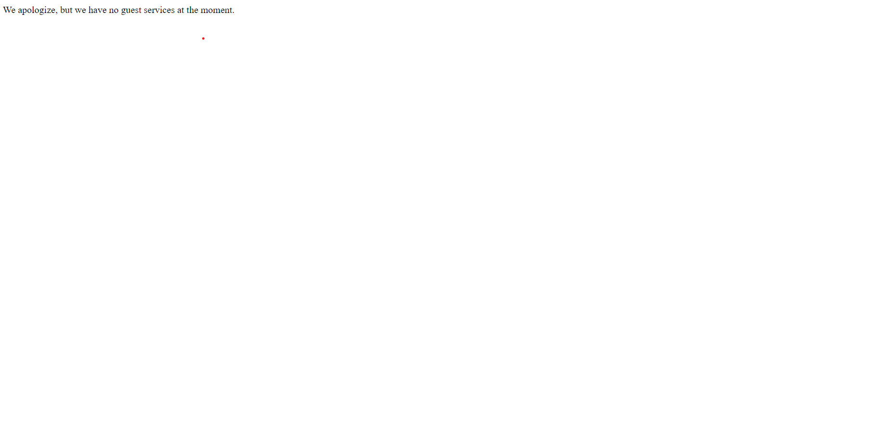
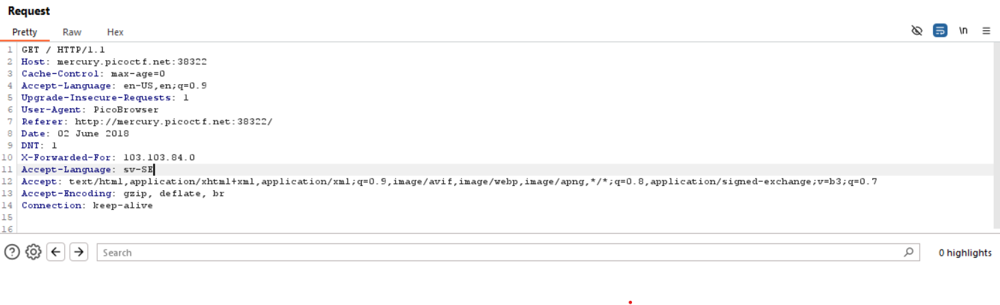

## dont-use-client-side
Started of by opening the website then inspecting the button element, I found that the verify button calls a verify() function.
Went to the script part of the code and found the verify() function where the flag was given in a jumbled manner.
Tracing the numbers given in split I found the flag.(0-1, 1-2, 2-3,.... and so on);

## Inspect HTML
The challenge was pretty simple, just had to inspect the page and the flag was directly given in the code.

## Intro to Burp
Installed Burp Suite, I went through the hints and found that I should mangle the request, so I searched how to do it.
First I opened the webiste on the Burp Browser, used Proxy->Intercept, sent it to a repeater.
Then on the OTP screen I sent a request where I removed the OTP Body Parameter Request and got the Flag.

## where are the robots
I was pretty confused with this program so I had to do some reasearch.
I learned about robots.txt which is a file which tells the crawlers(a program that scans websites.) what can be accessed on the website.
So I appended /robots.txt which gave me a screen that displayed the information of a page that has been disallowd. I went there to get the flag.

## SQL Direct
Downloaded postgreSQL for this problem.
I got into the right database using \l to list and \c {Database Name} to change to that database.
Found the flag table and I tried reading the table using SELECT * FROM flag but its not working.
I realised that I missed the semicolon...

## Some Assembly Required 1
Decoded the obfuscated code. Then I tried changing the code to give me the flag, but that didn't work out.
Just went through the wasm file in sources and found the flag there.

## Who are you?
The website wanted me to access it from PicoBrowser.
So I went into Burp and intercepted it and replaced chrome with PicoBrowser in the request, then it showed that it doesnt trust users from other websites.

## Power Cookies
- On launching the instance we get this webpage:
  
- After clicking the button I came to a dead end.
  
- So I went back to inspect HTML, where I found the function that the button calls.
  
- I went to the script to check the function.
  
- Here I changed the value from `document.cookie = "isAdmin=0"` to `document.cookie = "isAdmin=1"`.
- After saving this, I clicked on the button and got the flag.
  

## Who are you?
- This challenge opens up a website showing this:

- I tried inspecting element but that didn't help, so I opened the website using BurpSuite.

- I only saw that the User-agent value showed the Browser information, so I changed it to PicoBrowser.

- The webpage showed me this.

- This got me stuck for a bit, so I used the hint and learned about RFC(Request For Comments, Documentation regarding standards and rules for internet).
- I did some research to understand what is actually happening.  [Given Here](WebExp_Extra.md)
- Since the website does not want users visiting from another website I added another header `Referer:` (Which I found here: https://datatracker.ietf.org/doc/html/rfc2616#section-3.3) in which I specified the same website.

- Now it wants me to change the date:

- I went through the RFC documentation for date to find the format.

- Then added it to the request and got:

- After searching I found that you use `DNT:` header to set 0/1 for tracking.

- Now it requires me to be from Sweden, so I tried changing language/locations and nothing worked, after a bit more trial and error I figured out that I have to specify a Swedish IP address using `X-Forwarded-For:` header, So I searched up a Swedish IP and added this header.

- I changed the language to sv-SE using `Accept-Language:` header and finally got the flag.

## More SQLi
- Opened the website:

- On inputting random credentials:
  
- Then I researched a bit on SQL injection and found [this](https://learn.snyk.io/lesson/sql-injection/) website helpful.
- I tried to put `idontknow' or 1=1; --` into the username and password.

- I tried running the same thing again in the search bar but got nothing, Then checked the hint to find that it is SQLite.
- I tried to inject _SHOW TABLES_ but it didn't work, after asking ChatGPT I found out the metadata was stored in a system table _sqlite_master_, now to access it I used `' UNION SELECT name,sql,null FROM sqlite_master; --`.
- I used _null_ here to match the column count which is 3.

- Now I found out that _more_table_ contains the flag, so I used `' UNION SELECT flag,null,null FROM more_table; --` and got the flag.

#### Note:
- `--` is used to indicate a comment and it will ignore everything afterwards.
- The _sql_ column contains the CREATE statement that defines the structure of the object.
- We use UNION in SQL injection to combine the results of an injected query with the results of the original query.
